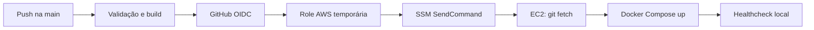

# DeployPath: GitHub Actions, AWS SSM e Docker Compose

O **DeployPath** é um laboratório funcional de entrega contínua. Cada atualização enviada para a branch `main` passa por validação TypeScript, build do Vite e build da imagem Docker. Após essas verificações, o GitHub Actions obtém credenciais AWS temporárias por OIDC e envia o comando de implantação à EC2 pelo AWS Systems Manager, sem abrir SSH e sem armazenar uma Access Key no GitHub.[1] [2]

| Componente | Configuração deste laboratório |
|---|---|
| Repositório | `clvschaves/aws-ssm-github-actions-demo` |
| Workflow | `.github/workflows/deploy.yml` |
| Região AWS | `us-east-1` |
| Instância | `i-03e69e83fc6b8193c` |
| IP público atual | `100.58.68.9` |
| Diretório remoto | `/opt/aws-ssm-github-actions-demo` |
| Porta publicada | `8082/TCP` |
| Origem autorizada | `200.10.185.12/32` |
| Role do pipeline | `DeployPathGitHubActionsRole` |
| Runtime | Docker Compose |

## Fluxo de implantação



O workflow usa `permissions: id-token: write` exclusivamente para solicitar o token OIDC e `contents: read` para ler o repositório. A política de confiança da role restringe o `sub` ao repositório e ao ambiente `production`; a política de permissões limita o envio de comandos à instância desta demonstração e ao documento `AWS-RunShellScript`.[1] [3]

## Segurança de rede

O Security Group `sg-077074a47d87bd92a` permite a porta `8082/TCP` somente para `200.10.185.12/32`. O Nginx repete a restrição dentro do container, criando uma segunda camada. Requisições locais ao conteúdo retornam `403`, enquanto `/healthz` permanece disponível apenas para o healthcheck interno. A porta 22 não participa do pipeline.

> O endereço da aplicação é `http://100.58.68.9:8082`, mas ele responde somente quando a conexão se origina do IP autorizado `200.10.185.12`.

## Atualização automática

Para publicar uma alteração, modifique o projeto e envie um commit para `main`. O workflow executará automaticamente:

```bash
pnpm install --frozen-lockfile
pnpm run check
pnpm exec vite build
docker build --tag deploypath:${GITHUB_SHA} .
```

Na EC2, o comando remoto fixa o diretório exatamente no SHA aprovado e recria o serviço:

```bash
git fetch --prune --depth=1 origin "$REVISION"
git reset --hard "$REVISION"
APP_PORT=8082 docker compose up -d --build --remove-orphans
curl --fail http://127.0.0.1:8082/healthz
```

Se o healthcheck não responder em até 90 segundos, o comando falha, imprime o estado dos containers e os últimos logs, fazendo o job do GitHub Actions terminar como falha.

## Arquivos operacionais

| Arquivo | Responsabilidade |
|---|---|
| `Dockerfile` | Compilar o frontend e criar a imagem Nginx |
| `docker-compose.yml` | Publicar o serviço isolado na porta 8082 |
| `deploy/nginx.conf` | SPA, cabeçalhos de segurança, healthcheck e filtro de IP |
| `deploy/configure-aws-oidc.sh` | Criar ou atualizar provedor OIDC e role IAM |
| `deploy/iam/github-actions-permissions.json` | Menor privilégio para SSM |
| `deploy/iam/github-oidc-trust.template.json` | Confiança OIDC restrita ao repositório e ambiente |
| `deploy/security-group-ingress.json` | Regra de entrada `200.10.185.12/32 → 8082` |

## Verificação e manutenção

O histórico do pipeline está disponível na aba [Actions](https://github.com/clvschaves/aws-ssm-github-actions-demo/actions). Na EC2, os comandos abaixo permitem conferir o estado sem alterar os demais serviços:

```bash
cd /opt/aws-ssm-github-actions-demo
docker compose ps
docker compose logs --tail=100
curl -i http://127.0.0.1:8082/healthz
git rev-parse HEAD
```

Para remover apenas esta demonstração:

```bash
cd /opt/aws-ssm-github-actions-demo
docker compose down --remove-orphans
```

Esse comando não atua nos projetos que utilizam as portas 8080 e 8081.

## Referências

[1]: https://docs.github.com/actions/deployment/security-hardening-your-deployments/configuring-openid-connect-in-amazon-web-services "GitHub Docs — Configuring OpenID Connect in Amazon Web Services"
[2]: https://docs.aws.amazon.com/systems-manager/latest/userguide/execute-remote-commands.html "AWS Systems Manager — Running commands using Systems Manager Run Command"
[3]: https://docs.aws.amazon.com/IAM/latest/UserGuide/id_roles_create_for-idp_oidc.html "AWS IAM — Creating a role for OpenID Connect federation"
